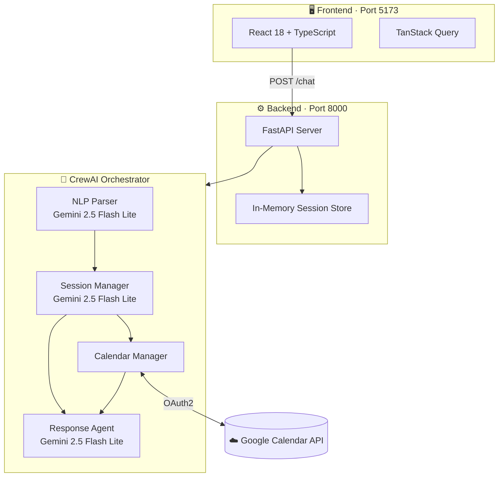
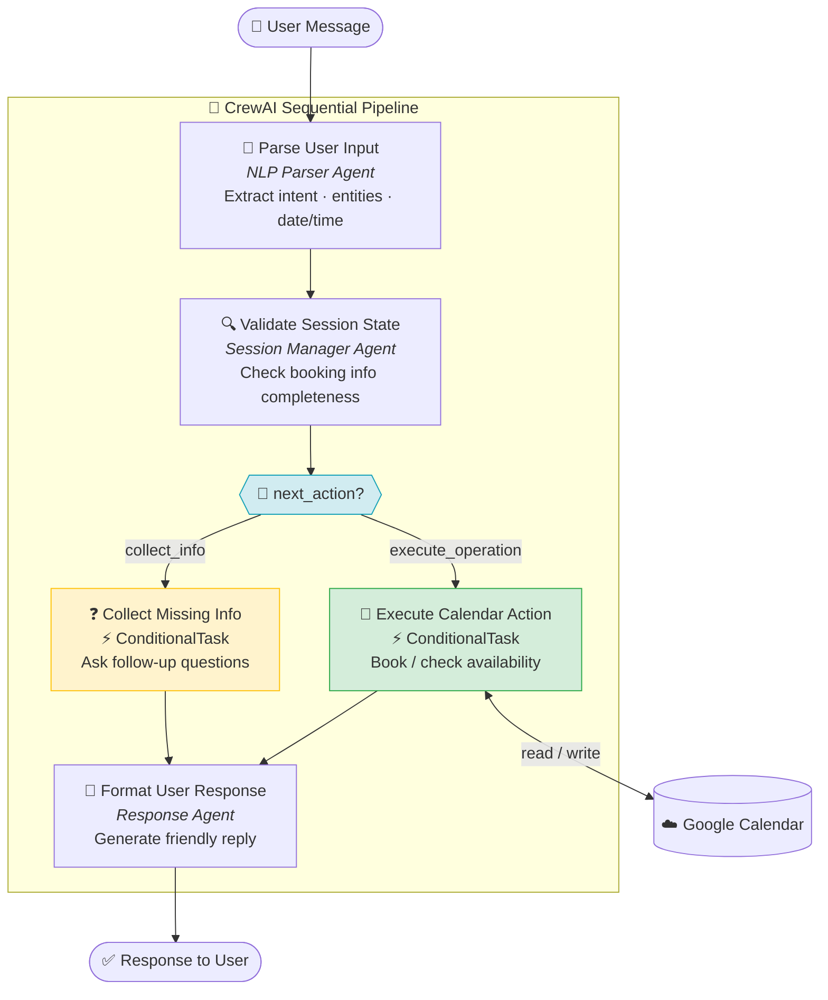

<div align="center">

# 🤖 SlotBot

### AI-Powered Calendar Booking Assistant

*Book appointments through natural language — powered by a coordinated ensemble of specialized AI agents*

<br/>

[](https://www.python.org/)
[](https://fastapi.tiangolo.com/)
[](https://www.crewai.com/)
[](https://ai.google.dev/)

[](https://react.dev/)
[](https://www.typescriptlang.org/)
[](https://vitejs.dev/)
[](https://tailwindcss.com/)
[](https://developers.google.com/calendar)

</div>

---

## Demo

<div align="center">
  [](https://youtu.be/C7dZhD9ZNn4)
</div>

---

## Overview

SlotBot eliminates the back-and-forth of scheduling by letting users book calendar appointments through plain conversation. A pipeline of **four specialized AI agents** coordinates autonomously — parsing intent, tracking session state, checking real availability, and confirming bookings — all powered by Google Gemini 2.5 Flash Lite.

> **"Book me an appointment with Sarah on Tuesday at 5pm"** → Parsed → Validated → Booked → Confirmed ✅

### Why Multi-Agent?

| Single-Model Approach | SlotBot Multi-Agent |
|---|---|
| One model handles everything | Each agent is an expert in one domain |
| Context window fills up quickly | Agents pass structured typed outputs |
| No conditional branching | Workflow adapts to missing information |
| Hard to debug or extend | Isolated agents with Pydantic-typed outputs |

---

## Architecture



---

## Agent Workflow



**Five-task pipeline with conditional branching:**

1. `parse_user_input` — structured entity extraction (intent, email, date, time)
2. `validate_session_state` — determines `next_action`: `collect_info` or `execute_operation`
3. `collect_missing_information` *(ConditionalTask)* — fires only when info is incomplete
4. `execute_calendar_action` *(ConditionalTask)* — fires only when booking can proceed
5. `format_user_response` — final user-facing message

---

## Tech Stack

<details>
<summary><strong>Backend</strong></summary>

| Technology | Purpose |
|---|---|
| **FastAPI** | Async HTTP server with automatic OpenAPI docs |
| **CrewAI 0.134+** | Multi-agent orchestration framework |
| **Google Gemini 2.5 Flash Lite** | LLM powering all four agents |
| **Google Calendar API** | Calendar read/write via OAuth2 |
| **Pydantic** | Typed data validation across agent boundaries |
| **Uvicorn** | ASGI production server |
| **Python 3.10–3.13** | Runtime |

</details>

<details>
<summary><strong>Frontend</strong></summary>

| Technology | Purpose |
|---|---|
| **React 18** | UI rendering |
| **TypeScript 5.5** | Type-safe JavaScript |
| **Vite 5.4** | Fast dev server and bundler |
| **Shadcn/UI** | Accessible component library (Radix UI primitives) |
| **Tailwind CSS 3.4** | Utility-first styling |
| **TanStack Query 5** | Server state and data fetching |
| **React Router 6** | Client-side routing |
| **Sonner** | Toast notifications |

</details>

---

## Project Structure

```
slotbot/
├── api/                        # FastAPI application
│   ├── main.py                # App entry point + CORS middleware
│   ├── dependencies.py        # DI + in-memory session store
│   ├── schemas.py             # Pydantic API contracts
│   └── routes/
│       ├── chat.py            # /start_chat, /chat endpoints
│       └── health.py          # /health check
│
├── src/slotbot/               # Core business logic
│   ├── crew.py                # CrewAI agent orchestration (5 tasks, 4 agents)
│   ├── models.py              # Domain models (UserInputParsed, SessionState, BookAppointmentOutput)
│   ├── config/
│   │   ├── agents.yaml        # Agent roles, goals, and LLM config
│   │   └── tasks.yaml         # Task descriptions and expected outputs
│   ├── tools/
│   │   ├── calendar_tools.py  # BookAppointmentTool, CheckAvailabilityTool
│   │   └── custom_tool.py
│   └── google_api/
│       └── Oauth_client.py    # OAuth2 flow for Google Calendar
│
├── frontend/                  # React + TypeScript UI
│   ├── src/
│   │   ├── App.tsx
│   │   └── main.tsx
│   └── package.json
│
├── knowledge/                 # Agent knowledge base files
├── outputs/                   # Task output artifacts (JSON, for debugging)
├── tests/                     # Test suite
├── pyproject.toml
└── requirements.txt
```

---

## Getting Started

### Prerequisites

- **Python** 3.10–3.13
- **Node.js** 18+ with npm or pnpm
- A **Google Cloud Project** with the Calendar API enabled
- **OAuth 2.0 credentials** downloaded as `credentials.json`

### Backend Setup

```bash
# 1. Clone the repository
git clone <repository-url>
cd slotbot

# 2. Create and activate a virtual environment
python -m venv .venv
source .venv/bin/activate        # Windows: .venv\Scripts\activate

# 3. Install dependencies
pip install -r requirements.txt

# 4. Configure environment variables
cp .env.example .env             # then fill in your values
```

### Environment Variables

```env
# LLM
GEMINI_API_KEY=your_gemini_api_key

# Google Calendar OAuth
GOOGLE_CALENDAR_ID=your_calendar_id@gmail.com
```

> Place your downloaded `credentials.json` (OAuth client secrets) in the **project root**. This file is gitignored — never commit it.

### Google Calendar Setup

1. Go to [Google Cloud Console](https://console.cloud.google.com/)
2. Create a project and enable the **Google Calendar API**
3. Create **OAuth 2.0 credentials** (Desktop app)
4. Download the credentials as `credentials.json` to the project root
5. On first run, a browser window will open for OAuth consent — this creates `token.json`

### Frontend Setup

```bash
cd frontend
npm install        # or: pnpm install
```

---

## Usage

### Start the Backend

```bash
uvicorn api.main:app --reload --host 0.0.0.0 --port 8000
```

| URL | Description |
|---|---|
| `http://localhost:8000` | API base |
| `http://localhost:8000/docs` | Swagger UI |
| `http://localhost:8000/redoc` | ReDoc |

### Start the Frontend

```bash
cd frontend
npm run dev        # or: pnpm dev
# → http://localhost:5173
```

---

## API Reference

### `POST /start_chat`

Initialize a new conversation session.

```json
// Response
{
  "session_id": "uuid-string",
  "message": "Welcome! How can I help you schedule today?"
}
```

### `POST /chat`

Send a user message and receive an agent-generated response.

```json
// Request
{
  "session_id": "uuid-string",
  "user_message": "Book me an appointment Tuesday at 5pm"
}

// Response
{
  "session_id": "uuid-string",
  "chatbot_response": "I'd be happy to help! Could I get your name and email address?"
}
```

### `GET /health`

Returns API health status.

---

## Development

### Running Tests

```bash
pytest                          # all tests
pytest tests/test_crew.py       # specific file
```

### Code Style

```bash
ruff check .    # lint
ruff format .   # format
```

The project follows **SOLID principles**:
- **Single Responsibility** — each agent handles exactly one domain
- **Open-Closed** — add new agents/tools without touching the core pipeline
- **Repository pattern** for data access
- **Pydantic** for strict type safety across all agent boundaries

---

## Configuration

Agent roles, goals, and LLM settings are defined in [src/slotbot/config/agents.yaml](src/slotbot/config/agents.yaml).

Task descriptions, expected outputs, and context chaining are in [src/slotbot/config/tasks.yaml](src/slotbot/config/tasks.yaml).

---

## Contributing

1. Fork the repository
2. Create a feature branch: `git checkout -b feature/amazing-feature`
3. Commit using conventional commits: `git commit -m 'feat: add amazing feature'`
4. Push to the branch: `git push origin feature/amazing-feature`
5. Open a Pull Request

---

## License

This project is licensed under the **MIT License** — see the [LICENSE](LICENSE) file for details.

---

## Acknowledgments

- [CrewAI](https://www.crewai.com/) — multi-agent orchestration framework
- [Shadcn/UI](https://ui.shadcn.com/) — beautifully accessible UI components
- [Google Calendar API](https://developers.google.com/calendar) — calendar integration
- [Google Gemini](https://ai.google.dev/) — LLM backbone for all agents

---

> **Security note**: Keep `credentials.json`, `token.json`, and `.env` out of version control. All three are gitignored by default.

<div align="center">
  <sub>Built with CrewAI · FastAPI · React</sub>
</div>
